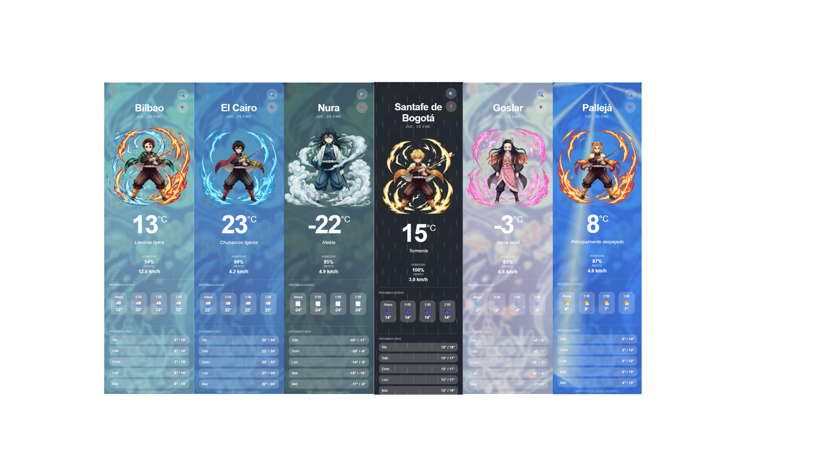

# 🌤️ El Tiempo — Mobile Weather App

Aplicación web **mobile-first** que muestra el tiempo actual, las próximas horas y los próximos días según la ubicación del usuario o una ciudad buscada manualmente.

El proyecto consume datos meteorológicos reales y los combina con una **experiencia visual inspirada en el anime Kimetsu no Yaiba (Demon Slayer)**, utilizando personajes y efectos que representan distintos estados del clima.

---

## 🚀 Demo online (GitHub Pages)

👉 **[Ver demo en GitHub Pages](https://david-navarro-oliver.github.io/el-tiempo/)**

La aplicación está desplegada mediante **GitHub Pages** directamente desde el repositorio, permitiendo probarla sin instalación previa.

---

## 📸 Capturas del proyecto

> Diferentes estados meteorológicos representados mediante personajes del anime *Kimetsu no Yaiba*.

---

## 🧩 Funcionalidades principales

- 📍 **Geolocalización automática** al cargar la página
- 🔍 **Búsqueda manual de ciudades**
- 🌡️ Tiempo actual (temperatura, humedad y viento)
- ⏰ Pronóstico por **próximas horas**
- 📅 Pronóstico por **próximos días**
- 🎨 Animaciones y efectos visuales según el clima
- ⏳ **Estado de carga (loading)** durante las peticiones
- 📱 Diseño **responsive y optimizado para móvil**
- 💡 Código organizado siguiendo principios de **clean code**

---

## 🎨 Inspiración visual: Kimetsu no Yaiba

Las imágenes utilizadas pertenecen al anime **Kimetsu no Yaiba (Demon Slayer)**.

Los personajes han sido seleccionados de forma **intencionada y simbólica**, relacionando su personalidad y estilo de combate con distintos estados meteorológicos, para reforzar la experiencia visual de la aplicación:

- 🔥 **Kyojuro Rengoku** — Clima soleado  
  Su *Respiración del Fuego* representa energía, calor y luz, por lo que aparece en días despejados.

- 🌦️ **Tanjiro Kamado** — Sol y lluvia  
  Asociado a climas variables y transiciones, reflejando su evolución constante y adaptabilidad.

- 🌊 **Giyu Tomioka** — Lluvia  
  Su *Respiración del Agua* encaja de forma natural con climas húmedos y lluviosos.

- ⚡ **Zenitsu Agatsuma** — Tormenta  
  Representa tormentas eléctricas y relámpagos por su *Respiración del Rayo*.

- ❄️ **Nezuko Kamado** — Nieve  
  Asociada a climas fríos y condiciones de nieve.

- 🌫️ **Muichiro Tokito** — Niebla  
  Su carácter etéreo y su presencia silenciosa encajan con condiciones de baja visibilidad.

Esta elección es **puramente estética y de UX**, pensada para hacer la aplicación más visual y atractiva, sin afectar al funcionamiento técnico ni a la precisión de los datos meteorológicos.

---

## 🧠 Arquitectura y enfoque técnico

El proyecto está desarrollado en **JavaScript modular**, separando responsabilidades:

- `weather.js` → llamadas a la API y configuración del clima
- `location.js` → geolocalización y conversión ciudad ↔ coordenadas
- `ui.js` → renderizado de la interfaz y animaciones
- `main.js` → orquestación general de la aplicación

Este enfoque facilita la **legibilidad**, el **mantenimiento** y la **escalabilidad** del código.

---

## 🛠️ Tecnologías utilizadas

- HTML5
- CSS3 (sin frameworks, enfoque custom)
- JavaScript (ES Modules)
- Git & GitHub (ramas y conventional commits)
- GitHub Pages (despliegue)

---

## 🌍 APIs utilizadas

- **Open-Meteo Weather API**  
  https://open-meteo.com  
  (datos meteorológicos)

- **Open-Meteo Geocoding API**  
  (ciudad → coordenadas)

- **BigDataCloud Reverse Geocoding API**  
  (coordenadas → nombre de ciudad)

---

## ▶️ Cómo ejecutar el proyecto en local

### Opción recomendada (VS Code)

1. Instala la extensión **Live Server**
2. Abre el proyecto en VS Code
3. Click derecho sobre `index.html` → **Open with Live Server**

### Alternativa con Node.js

    npx serve .

---

## 🗂️ Estructura del proyecto

    .
    ├── index.html
    └── assets
        ├── css
        ├── js
        ├── img
        └── data

---

## 🤖 Uso de IA

He utilizado **IA generativa (ChatGPT)** como herramienta de apoyo para:

- Propuesta y revisión de la arquitectura JavaScript
- Separación de responsabilidades (fetch, lógica y UI)
- Mejora del naming y aplicación de clean code
- Detección y corrección de errores lógicos
- Optimización del flujo de datos al cambiar de ciudad
- Ajustes de UX/UI en versión móvil (estado de carga, refinamientos)

La IA se ha utilizado **como herramienta de apoyo**, no como sustituto del desarrollo ni de la toma de decisiones técnicas.

---

## ✅ Estado del proyecto

✔ Funcional  
✔ Responsive  
✔ Desplegado en GitHub Pages  

---

## 👤 Autor

Proyecto desarrollado de forma individual como práctica de consumo de APIs y diseño de aplicaciones web orientadas a móvil.
